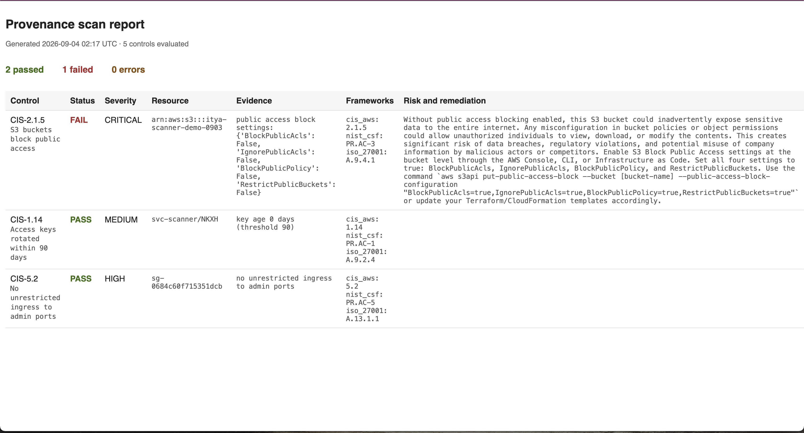

# Provenance

An AWS control scanner that collects evidence against CIS benchmark controls..

## What it does

Each check queries the AWS APIs directly, compares the result against a named control, and returns a finding with a control ID, status, resource ARN, evidence, and severity. Passes are recorded as well as failures, because an auditor needs proof that a control was tested rather than silence.

## Controls implemented

| Control | Description | Severity |
|---------|-------------|----------|
| CIS-1.10 | MFA enabled for IAM users with console access | HIGH |
| CIS-1.14 | Access keys rotated within 90 days | MEDIUM |
| CIS-2.1.5 | S3 buckets block public access | CRITICAL |
| CIS-2.2.1 | EBS volumes encrypted at rest | HIGH |
| CIS-5.2 | No unrestricted ingress to admin ports | HIGH |

## Setup

Requires Python 3 and an AWS account. Create a virtual environment, install boto3, and run scanner.py.

Credentials are read from ~/.aws/credentials via boto3's default provider chain. No keys are stored in this repository.

## Security decisions

**Least privilege.** This scanner runs as its own service account with only the AWS-managed SecurityAudit policy, which is read-only access to configuration. If the key is leaked, an attacker can learn how the account is configured but they cannot change or delete anything.

**Long-lived access keys.** AWS recommends short-lived credentials over static keys, and even though they are right about that, this scanner uses a static key since it runs locally against a personal account with a read-only scope. If it were in production it would have run as an assumed IAM role with no permanent credential.

**Scan output is evidence.** The results contain real account IDs and resource names, which is a list of the infrastructure and its weaknesses. Because of that, the output directory is gitignored and any committed sample data is sanitized.

## Design notes

**Checks are pluggable.** Every check is a module with a run(session) function returning findings in a shared shape. Adding a control means adding one file and one line to the runner, which means the reporting layer never changes.

**Pagination is mandatory.** A continuation token is given when AWS list APIs cap results, and ignoring it can mean auditing the first page and reporting clean for everything past it. This leads to a false negative that is indistinguishable from actual compliance.

**Applicability is part of the control.** CIS 1.10 applies to IAM users with a console password only. My first version flagged a service account that can't have MFA at all, so the check skips users without console access.

## Known limitations

- Single region. Regional services are enumerated only in the configured region. Multi-region enumeration is not yet implemented.
- No "not tested" state. A control that could not be evaluated for lack of permission is reported as an error rather than as untested, which an auditor would want distinguished.
- No historical comparison. Each run is a point-in-time snapshot with no drift detection between scans.
- Control coverage is partial. This implements a subset of the CIS benchmark, not the full standard.
- Security group rules using protocol -1 (all traffic) are skipped rather than flagged, so a fully open rule is currently missed.
- Only IPv4 ranges are evaluated. IPv6 ranges (::/0) are not checked.
